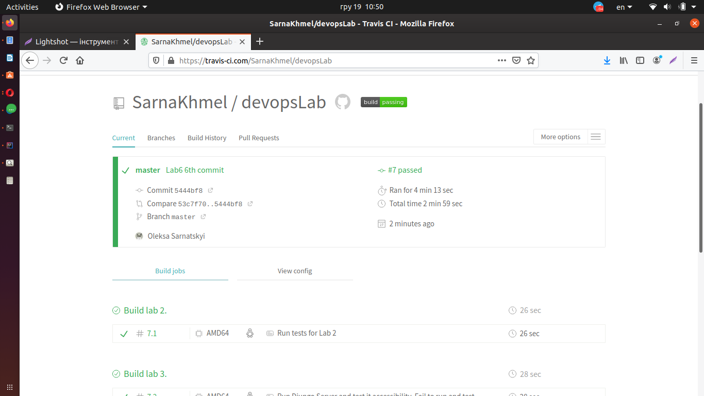

#Lab_6

1. Зареєструвався на Travis
2. Ознайомився з документацією Travis
3. Додав файл travis.yml 
4. Запустив, виправив помилки які виникли в процесі.
5. Надав доступ до файлу.s
6. Отримав позитивний результат перевірки.

Посилання на тревіс
[travis link](https://travis-ci.com/SarnaKhmel/devopsLab)
- 
